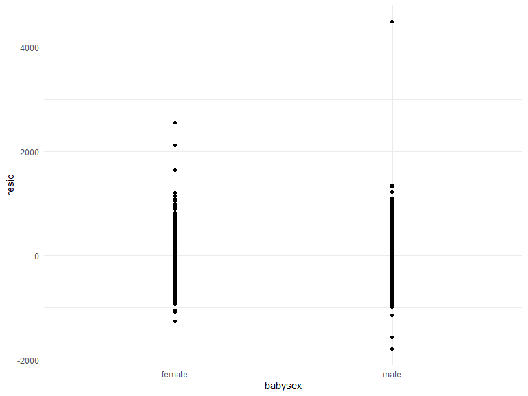

Homework 6
================
Hemangi Modi
2022-12-03

### Problem 2

``` r
homicides_df = 
  read_csv("data/homicide-data.csv") %>% 
  mutate(
    city_state = str_c(city, ", ", state ),
    case_solved = case_when(disposition == "Open/No arrest" | disposition == "Closed without arrest" ~ 0, disposition == "Closed by arrest" ~ 1),
    victim_age = as.numeric(victim_age)
  ) %>% 
  subset(!(city_state %in% c("Dallas, TX", "Tulsa, AL", "Phoenix, AZ", "Kansas City, MO"))) %>% 
  subset(victim_race %in% c("White", "Black"))
```

    ## Rows: 52179 Columns: 12
    ## ── Column specification ────────────────────────────────────────────────────────
    ## Delimiter: ","
    ## chr (9): uid, victim_last, victim_first, victim_race, victim_age, victim_sex...
    ## dbl (3): reported_date, lat, lon
    ## 
    ## ℹ Use `spec()` to retrieve the full column specification for this data.
    ## ℹ Specify the column types or set `show_col_types = FALSE` to quiet this message.

``` r
baltimore_regress = homicides_df %>% 
  filter(
    city_state == "Baltimore, MD"
  ) %>% 
  mutate(
    victim_sex = fct_relevel(victim_sex, "Female"),
    victim_race = fct_relevel(victim_race, "White")
  )

baltimore_fit = baltimore_regress %>% 
  glm(case_solved ~ victim_age + victim_sex + victim_race, data = ., family = binomial())

baltimore_fit_stats = baltimore_fit %>% 
  broom::tidy(conf.int = TRUE) %>%  
  mutate(
    OR = exp(estimate),
    OR_conf.low = exp(conf.low),
    OR_conf.high = exp(conf.high)
  ) %>% 
  select(term, OR, OR_conf.low, OR_conf.high) %>% 
  filter(term == "victim_sexMale")

baltimore_fit_stats
```

    ## # A tibble: 1 × 4
    ##   term              OR OR_conf.low OR_conf.high
    ##   <chr>          <dbl>       <dbl>        <dbl>
    ## 1 victim_sexMale 0.426       0.324        0.558

``` r
city_fit = homicides_df %>% 
  nest(data = -city_state) %>% 
  mutate(
    all_cities = map(data, ~glm(case_solved ~ victim_age + victim_sex + victim_race, data = ., family = binomial())),
    model_results = map(all_cities, broom::tidy,conf.int = TRUE)
  ) %>% 
  select(city_state, model_results) %>% 
  unnest(cols = model_results) %>% 
  mutate(
    OR = exp(estimate),
    OR_conf.low = exp(conf.low),
    OR_conf.high = exp(conf.high)
  ) %>% 
  select(city_state, term, OR, OR_conf.low, OR_conf.high) %>% 
  filter(term == "victim_sexMale") %>% 
  arrange(OR)

homicides_OR_plot = ggplot(data = city_fit, aes(x = reorder(city_state, OR), y = OR)) + 
  geom_point() + 
  geom_errorbar(aes(ymax = OR_conf.high, ymin = OR_conf.low)) +
  theme(axis.text.x = element_text(angle = 60, hjust = 1))
```

The plot below shows the estimated odds ratios and confidence intervals
for each city. As seen in the plot below, New York, NY has the lowest
odds ratio - the odds of a homicide case being solved for male victims
is lower than that for female victims in New York, NY, keeping all other
variables fixed. This ratio changes from city to city with Albuquerque,
NM having an estimated odds ratio higher than 1 - which can be
interpreted as the odds of a homicide being solved for male victims is
higher than that for female victims, in Albuquerque, NM, keeping all
other variables fixed.

``` r
homicides_OR_plot
```


### Problem 3

``` r
birthweights_df = 
  read_csv("data/birthweight.csv") %>% 
  mutate(
    babysex = as.factor(case_when(babysex == 1 ~ "male", babysex == 2 ~ "female")),
    frace = as.factor(case_when(frace == 1 ~ "White", frace == 2 ~ "Black", frace == 3 ~ "Asian", frace == 4 ~ "Puerto Rican", frace == 8 ~ "Other", frace == 9 ~ "Unknown")),
    malform = as.factor(case_when(malform == 0 ~ "absent", malform == 1 ~ "present")),
    mrace = as.factor(case_when(mrace == 1 ~ "White", mrace == 2 ~ "Black", mrace == 3 ~ "Asian", mrace == 4 ~ "Puerto Rican", mrace == 8 ~ "Other"))
  )
```

    ## Rows: 4342 Columns: 20
    ## ── Column specification ────────────────────────────────────────────────────────
    ## Delimiter: ","
    ## dbl (20): babysex, bhead, blength, bwt, delwt, fincome, frace, gaweeks, malf...
    ## 
    ## ℹ Use `spec()` to retrieve the full column specification for this data.
    ## ℹ Specify the column types or set `show_col_types = FALSE` to quiet this message.

The model below is a regression model for a child’s birth weight. I use
the following variables as predictors: presence of malformations, baby’s
length at birth, and baby’s sex as these variables are factors that can
potentially affect the weight at birth based on literature in this
space.

``` r
birthweights_fit = lm(bwt ~ malform + blength + babysex, data = birthweights_df)
```

``` r
birthweights_df %>% 
  modelr::add_residuals(birthweights_fit) %>% 
  add_predictions(birthweights_fit) %>% 
  ggplot(aes(x = malform, y = resid)) +
  geom_point()
```


``` r
birthweights_df %>% 
  modelr::add_residuals(birthweights_fit) %>% 
  add_predictions(birthweights_fit) %>% 
  ggplot(aes(x = blength, y = resid)) +
  geom_point()
```


``` r
birthweights_df %>% 
  modelr::add_residuals(birthweights_fit) %>% 
  add_predictions(birthweights_fit) %>% 
  ggplot(aes(x = babysex, y = resid)) +
  geom_point()
```



``` r
model_df = 
  crossv_mc(birthweights_df, 100)
```

``` r
model_df = 
  model_df %>% 
  mutate(
    train = map(train, as_tibble),
    test = map(test, as_tibble)
  )
```

``` r
model_df = 
  model_df %>% 
  mutate(
    bw_model1 = map(train, ~lm(bwt ~ malform + blength + babysex, data = .x)),
    bw_model2 = map(train, ~lm(bwt ~ blength + gaweeks, data = .x)),
    bw_model3 = map(train, ~lm(bwt ~ bhead + blength + babysex + bhead*blength + bhead*babysex + blength*babysex + bhead*blength*babysex, data = .x))
  )%>% 
  mutate(
    rmse_model1 = map2_dbl(bw_model1, test, ~rmse(model = .x, data = .y)),
    rmse_model2 = map2_dbl(bw_model2, test, ~rmse(model = .x, data = .y)),
    rmse_model3 = map2_dbl(bw_model3, test, ~rmse(model = .x, data = .y))
  )
```

We can see in the plot below that model 3 that has the following
predictors: head circumference, length, sex, and all interactions
between these predictors is the best model for predicting birth weight
as it has the lowest root mean squared errors (rmse).

``` r
model_df %>% 
  select(starts_with("rmse")) %>% 
  pivot_longer(
    everything(),
    names_to = "model", 
    values_to = "rmse",
    names_prefix = "rmse_") %>% 
  mutate(model = fct_inorder(model)) %>% 
  ggplot(aes(x = model, y = rmse)) + geom_violin()
```


